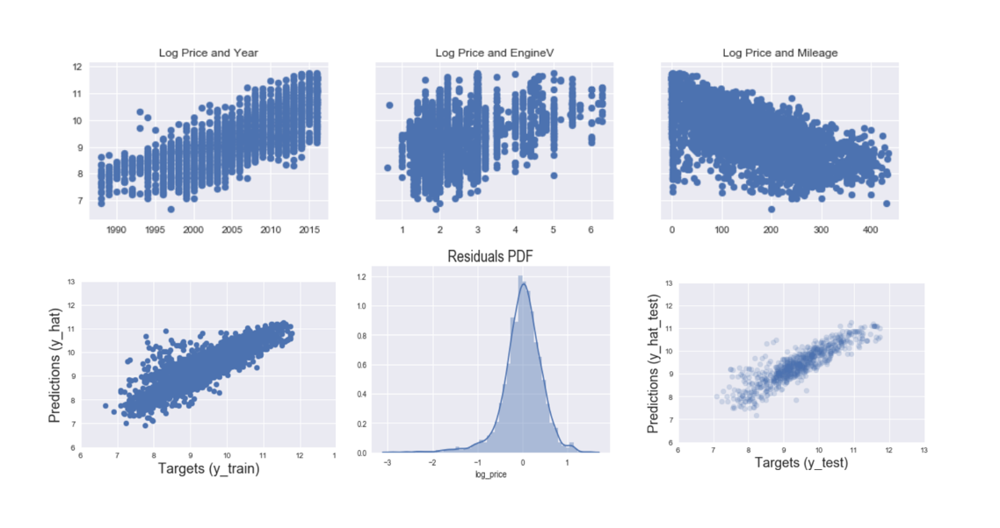

### Data Analyst | Data Scientist | Machine Learning

---

## Portfolio

---

### Data Analysis

An in-depth analysis of a dataset using various data science techniques.

---

### Machine Learning Model

.ipynb)

A machine learning model for a specific task, such as image classification.

---

### Jupyter ML Project

A machine learning project implemented in Jupyter notebooks.

---

Python Code Example (Click to Expand)

<pre><code>
# Python code to calculate the sum of two numbers

def calculate_sum(a, b):
    return a + b

result = calculate_sum(5, 7)
print("The sum is:", result)
</code></pre>

[Open this code in Jupyter Notebook](sklearn+-+Linear+Regression+-+Practical+Example+(Part+5).ipynb)

---

## Contact

Email: Tatyana_doughouz@yahoo.com

---

&copy; 2023 TD
